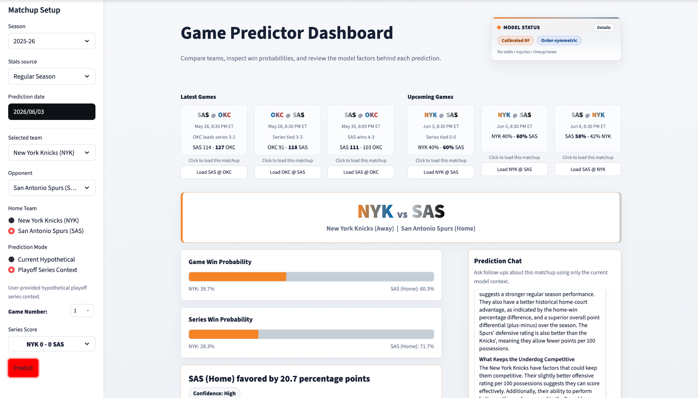
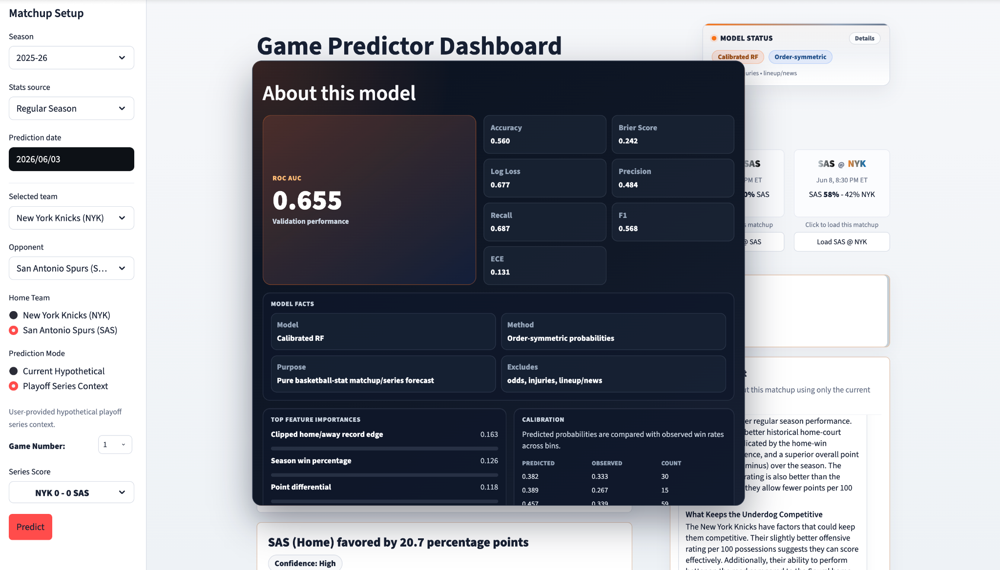
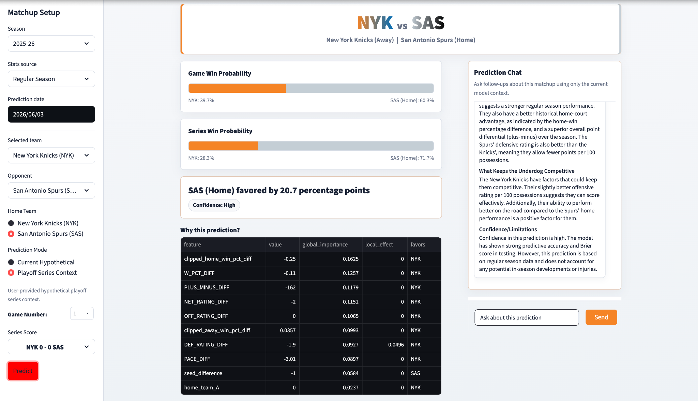

# NBA Playoff Game Predictor

NBA playoff matchup and series prediction dashboard built for concise, demo-ready model presentation.

[Live Demo](YOUR_STREAMLIT_APP_URL_HERE) · [Repository](.) · [Report Bug](REPORT_BUG_URL_HERE) · [Request Feature](REQUEST_FEATURE_URL_HERE)

## Table Of Contents

- [About The Project](#about-the-project)
- [Screenshots](#screenshots)
- [Built With](#built-with)
- [Key Features](#key-features)
- [Live Demo](#live-demo)
- [Getting Started](#getting-started)
  - [Prerequisites](#prerequisites)
  - [Installation](#installation)
- [Usage](#usage)
- [Deployment](#deployment)
- [Model Methodology](#model-methodology)
- [Model Dashboard](#model-dashboard)
- [Testing](#testing)
- [Training](#training)
- [Limitations](#limitations)
- [Roadmap](#roadmap)
- [Contact](#contact)
- [Acknowledgments](#acknowledgments)

## About The Project

NBA Playoff Game Predictor is a Streamlit dashboard for NBA playoff matchup and series prediction. It is a pure basketball-stat model: predictions are based on historical team performance features, not betting markets, injury reports, or breaking news.

The app presents game win probability, series win probability, prediction explainability, and a model dashboard popup for validation context. It is intended as a portfolio-ready demo of an end-to-end sports analytics workflow: data processing, feature engineering, calibrated modeling, interactive prediction, and model transparency.

[Back to top](#nba-playoff-game-predictor)

## Screenshots







[Back to top](#nba-playoff-game-predictor)

## Built With

- Python
- Streamlit
- pandas
- scikit-learn
- joblib
- NBA data

[Back to top](#nba-playoff-game-predictor)

## Key Features

- Live, latest, and upcoming games view.
- Matchup setup for Team A, Team B, home team, season, and prediction date.
- Current hypothetical and playoff series context modes.
- Order-symmetric predictions to reduce team-order bias.
- Prediction explanation table with feature values and directional factors.
- Model status/details dashboard with validation and calibration context.
- Prediction chat grounded in the current matchup and model outputs.

[Back to top](#nba-playoff-game-predictor)

## Live Demo

The public demo should be deployed on Streamlit Community Cloud:

`YOUR_STREAMLIT_APP_URL_HERE`

After deployment, users can open the hosted app directly without running Streamlit locally.

[Back to top](#nba-playoff-game-predictor)

## Getting Started

Follow these steps to run the project locally.

### Prerequisites

- Python 3
- `git`
- Access to this repository

### Installation

1. Clone the repository.

   ```bash
   git clone REPOSITORY_URL_HERE
   cd Playoff\ Game\ Predictor
   ```

2. Create a virtual environment.

   ```bash
   python3 -m venv .venv
   ```

3. Activate the virtual environment.

   ```bash
   source .venv/bin/activate
   ```

4. Install dependencies.

   ```bash
   ./.venv/bin/python -m pip install -r requirements.txt
   ```

5. Start the app.

   ```bash
   ./.venv/bin/python -m streamlit run app.py
   ```

[Back to top](#nba-playoff-game-predictor)

## Usage

Run the dashboard:

```bash
./.venv/bin/python -m streamlit run app.py
```

Run a CLI matchup prediction:

```bash
./.venv/bin/python -m src.predictor predict --team1 BOS --team2 NYK --season 2024-25 --prediction-date 2025-04-19 --home-team team1
```

Run a playoff series context prediction:

```bash
./.venv/bin/python -m src.predictor predict --team1 NYK --team2 BOS --season 2024-25 --prediction-date 2025-05-10 --home-team team1 --prediction-context-mode "Playoff Series Context" --game-number 6 --team-a-series-wins 3 --team-b-series-wins 2
```

[Back to top](#nba-playoff-game-predictor)

## Deployment

Recommended public deployment path:

1. Push the repository to GitHub.
2. Deploy `app.py` on Streamlit Community Cloud.
3. Set secrets in Streamlit Cloud if chat or API features are enabled.
4. Never commit API keys.
5. Replace `YOUR_STREAMLIT_APP_URL_HERE` in this README with the deployed URL.

[Back to top](#nba-playoff-game-predictor)

## Model Methodology

The production model uses a calibrated Random Forest to estimate playoff win probabilities from basketball-stat features. Calibration improves probability quality so outputs can be interpreted as estimated probabilities rather than only class labels.

Predictions use order-symmetric probability averaging:

```text
p_A_direct = P(A beats B)
p_A_reverse = 1 - P(B beats A)
p_A_final = (p_A_direct + p_A_reverse) / 2
```

Production feature groups include:

- Rating differentials
- Win percentage
- Plus-minus
- Pace
- Clipped home/away splits
- Seeding

[Back to top](#nba-playoff-game-predictor)

## Model Dashboard

The model details dashboard is designed to make the prediction system presentable during a demo. It highlights:

- ROC AUC hero metric
- Validation metrics
- Feature importances
- Calibration summary

[Back to top](#nba-playoff-game-predictor)

## Testing

```bash
./.venv/bin/python -m unittest discover -s tests
```

[Back to top](#nba-playoff-game-predictor)

## Training

```bash
./.venv/bin/python -m src.predictor train --start-season 2015-16 --end-season 2024-25
```

Training writes processed data, model comparison outputs, calibration outputs, feature importances, and the production model artifact used by the app.

[Back to top](#nba-playoff-game-predictor)

## Limitations

- No betting odds.
- No injuries or player availability.
- No lineup news.
- No breaking news.
- No live market data.
- Statistical baseline only.
- Not betting advice.

[Back to top](#nba-playoff-game-predictor)

## Roadmap

- Injury and player availability features
- Richer calibration monitoring
- Live benchmark comparison
- Public deployment polish
- README badges

[Back to top](#nba-playoff-game-predictor)

## Contact

Project Link: [Repository](.)

[Back to top](#nba-playoff-game-predictor)

## Acknowledgments

- Best-README-Template for README structure inspiration.
- NBA data sources used by the project.
- Python, Streamlit, pandas, scikit-learn, and joblib communities.

[Back to top](#nba-playoff-game-predictor)
